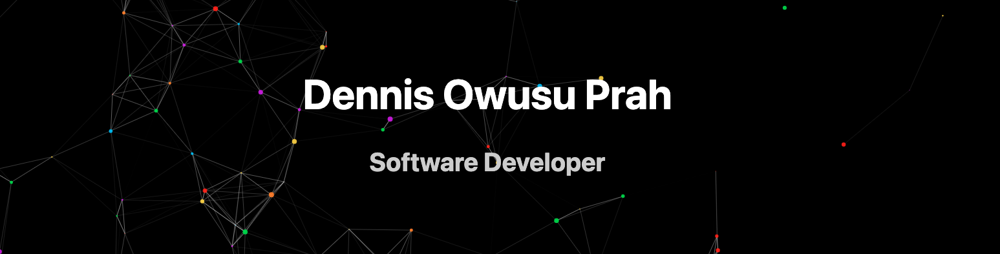

<p align="center">
 <a href="">
</a>
 
<!-- - 🌍  I'm based in Accra, Ghana
- ✉️  You can contact me at [padwusup@gmail.com](mailto:padwusup@gmail.com)
- 💞️ I’m looking to collaborate on React projects
- 🤝  I'm open to collaborating on interesting JavaScript projects
- ⚡ Fun fact: ...
- 👋 -->
 

✨
 ```javascript
const title: "Full Stack Developer"
const Owusu_Dennis = {
  pronouns: "he" | "him",
  coming_soon: [Typescript, Angular, Docker, Kubernetes],
  styled-component: 100%,
  skills: "check below",
  architecture: ["microservices", "design system pattern"],
  techCommunities: {
     forum: "stack overflow",
     mentor: "Marfo David"
  },
 challenge: "I am doing the #100DaysOfCode challenge focused on Python and Javascript",
 onGoing_certification: "IBM Data Science Professional Certificate on Coursera",
 certification: "AWS Certified Cloud Practitioner "
}
```
 
## ✨ Skills 💻

### Front-end Languages & Frameworks
 
<p align="left">
 <a href="#">
  
 </a>
 <a href="#">
    
 </a>
 <a href="#">
  
 </a>
 <a href="#">
  
 </a>
 <a href="#">
  
 </a>
 <a href="#">
  
 </a>
 <a href="#">
  
 </a>
</p>

### Back-end Languages & Frameworks
 
<p align="left">
 <a href="#">
    
 </a>
 <a href="#">
    
 </a>
  <a href="#">
  
 </a>
 <a href="#">
  
 </a>
</p>
 
### Server-side
<p align="left">
 <a href="#">
  
 </a>
 <a href="#">
    
 </a>
 <a href="#">
    
 </a>
</p>

### Databases

<p align="left">
 <a href="#">
    
 </a>
 <a href="#">
  
 </a>
 <a href="#">
    
 </a>
</p>

### Other Technologies

<p align="left"> 
 <a href="#">
  
 </a>
 <a href="#">
  
 </a>
 <a href="https://www.credly.com/badges/60a102d5-307a-48e6-8e51-e75ef84ec825">
  
 </a>
 <a href="#">
  
 </a>
</p>

### Certifications & Badges

[AWS Cloud Practitioner](https://www.credly.com/badges/60a102d5-307a-48e6-8e51-e75ef84ec825)
""
[Python for Data Science and AI](https://www.credly.com/badges/79ed795d-5ff0-4150-adae-815e5a84a194)


<a href="https://www.adamalston.com/"><!-- wi*quL3fcV --></a>


<!-- - 🔭 I’m currently working on ...
- 🌱 I’m currently learning ...
- 👯 I’m looking to collaborate on ...
- 🤔 I’m looking for help with ...
- 💬 Ask me about ...
- 📫 How to reach me: ...
- 😄 Pronouns: ...
 -->

